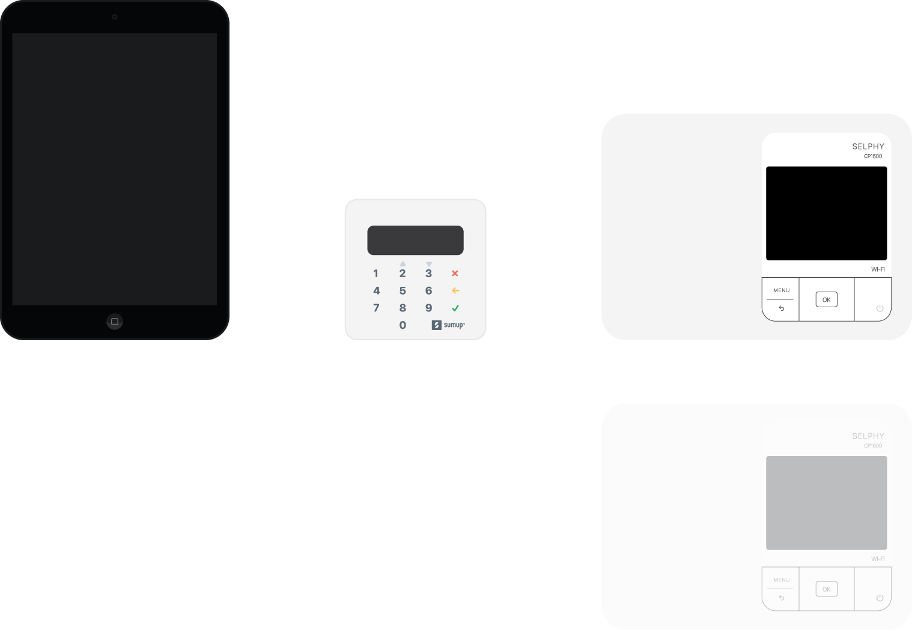

# 🚀 Beginner's Guide — Photobooth

Nog nooit iets met GitHub gedaan? Geen probleem. Deze gids leidt je stap voor stap door alles heen.

---

## Wat heb je nodig?

- iPad (mini 2 of nieuwer) met iOS 12 of hoger
- WiFi-netwerk of mobiele data
- Canon SELPHY CP1500 printer (op hetzelfde WiFi)
- SumUp Air of Solo betaalterminal
- Dat is alles — geen Mac, geen Xcode, geen installatie

---

## Stap 1 — De app op je iPad zetten

De app draait als website in Safari. Je hoeft **niets te downloaden**.

1. Open **Safari** op je iPad
2. Ga naar: **https://achimpieters.github.io/photobooth**
3. Wacht tot de pagina volledig geladen is
4. Tik op het **Delen-icoon** (vierkantje met pijl omhoog, onderin Safari)
5. Tik op **"Zet op beginscherm"**
6. Verander de naam naar **Photobooth** als dat nog niet zo is
7. Tik op **Voeg toe**

✅ De app staat nu als icoon op je beginscherm. Als je er op tikt, start hij volledig scherm op — zonder adresbalk.

> 💡 De eerste keer heb je internet nodig. Daarna werkt de app ook **offline** dankzij de Service Worker.

---

## Stap 2 — Printer verbinden

De Canon SELPHY CP1500 print via AirPrint. Dat werkt automatisch als de printer op hetzelfde WiFi-netwerk zit als de iPad.

1. Zet de SELPHY aan
2. Sluit hem aan op je WiFi:
   - Druk op **Menu** op de printer
   - Ga naar **Instellingen WiFi** → **WiFi setup**
   - Kies je netwerk en voer het wachtwoord in
3. Klaar — geen drivers nodig

Controleer: als de printer en iPad op hetzelfde WiFi zitten, vindt Safari hem automatisch bij het printen.

---

## Stap 3 — SumUp instellen

> Als je (nog) geen SumUp hebt, sla deze stap over. De app werkt dan zonder betaalfunctie.

1. Installeer de **SumUp app** op de iPad
2. Log in met je SumUp-account
3. Vraag je **Affiliate Key** op via [developer.sumup.com](https://developer.sumup.com)
4. Zet de key in GitHub Secrets (zie [configuratie](configuration.md))

---

## Stap 4 — Kiosk-modus instellen (Guided Access)

Guided Access vergrendelt de iPad op de photobooth-app. Gasten kunnen dan niet per ongeluk uitbreken.

**Eenmalig instellen:**
1. Ga naar **Instellingen → Toegankelijkheid → Guided Access**
2. Zet **Guided Access** aan
3. Tik op **Toegangscode-instellingen** → stel een pincode in (bijv. 4 cijfers)
4. Optioneel: zet **Face ID / Touch ID** aan

**Activeren voor een event:**
1. Open de **Photobooth app**
2. Druk **3× snel** op de Home-knop (of zijknop op nieuwere iPads)
3. Tik op **Start**

**Deactiveren:**
1. Druk **3× snel** op de Home-knop of zijknop
2. Voer je pincode in
3. Tik op **Stop**

---

## Stap 5 — Testen

1. Open de Photobooth app
2. Tik op **"Tik om te beginnen"**
3. Geef camera-toegang als Safari daarom vraagt
4. Maak 4 foto's
5. Bekijk de strip
6. Tik op **Betalen** → SumUp app opent
7. Betaal (of annuleer voor de test)
8. Strip wordt geprint

---

## Veelgestelde vragen

**De camera doet het niet.**
→ Ga naar Instellingen → Safari → Camera → Toestaan

**De printer wordt niet gevonden.**
→ Controleer of printer en iPad op hetzelfde WiFi zitten. Herstart de printer.

**De SumUp app opent niet.**
→ Installeer de SumUp app eerst op de iPad.

**De app werkt niet meer na een tijdje.**
→ Sluit Safari volledig en open de app opnieuw via het beginscherm-icoon.

---

Meer hulp? Zie [troubleshooting.md](troubleshooting.md)
